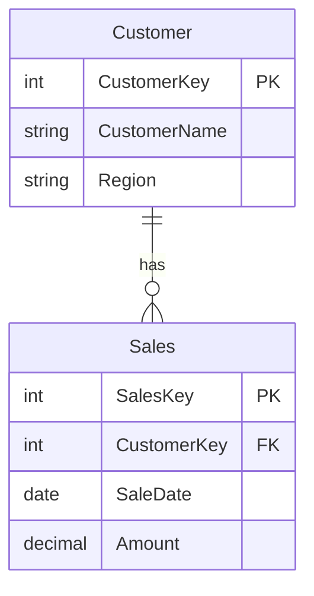

# Spec: Tool `generate_data_dictionary`

> Genera documentación legible del modelo semántico: Markdown / HTML con
> diagrama Mermaid, descripción de tablas / columnas / medidas / relaciones,
> coverage score y warnings sobre gaps.

**Status:** v0.1 (spec)
**Prioridad:** P1 — usado por workflow 01 §Fase 6, workflow 02 §Fase 6
**Responsable:** codehak
**Depende de:**
- [`../01-orchestrator.md`](../01-orchestrator.md) — orchestration
- [`../03-validation.md`](../03-validation.md) — auditing checks complementarios (descriptions, PII tags)
- [`../05-engines-adapters.md`](../05-engines-adapters.md) — ModelingEngine para extraer metadata

**Spec relacionado:** [`../../docs/architecture.md`](../../docs/architecture.md) §2.5

---

## Cambios respecto a v0.0

Spec inicial. Antes solo había una descripción de 1 línea en SPEC §4.5.

---

## 1. Objetivo

Extraer metadata completa de un modelo semántico (TMDL / PBIP / .pbix /
Fabric dataset) y generar documentación auto-explicativa que un humano o
agente pueda consultar para entender el modelo sin abrir Power BI Desktop.

**Métricas de éxito:**
- Generación p95 <10s para modelo mediano (50 tablas, 200 medidas).
- Coverage score ≥80% en modelos bien documentados (con descriptions).
- 0 secrets / connection strings en outputs (test automatizado).
- Diagrama Mermaid válido en 100% de modelos bien formados.

---

## 2. Inputs y outputs

### Input schema

```yaml
tool_name: generate_data_dictionary
input_schema:
  type: object
  required: [target]
  properties:
    target:
      oneOf:
        - type: object
          properties:
            type: {const: pbip_path}
            ref: {type: string}
        - type: object
          properties:
            type: {const: workspace}
            workspace_id: {type: string}
            dataset_id: {type: string}
        - type: object
          properties:
            type: {const: pbix_file}
            ref: {type: string}
            password: {type: string, nullable: true}
    output_format:
      type: string
      enum: [markdown, html, both]
      default: both
    output_path:
      type: string
      description: "Directorio destino. Default: ./out/"
    include:
      type: array
      items:
        type: string
        enum: [tables, columns, measures, relationships, hierarchies, mermaid_diagram, glossary, dax_expressions]
      default: [tables, columns, measures, relationships, mermaid_diagram]
    glossary_path:
      type: string
      nullable: true
      description: "YAML con términos de negocio (glosario) para enlazar en la doc"
    exclude_hidden:
      type: boolean
      default: true
    coverage_thresholds:
      type: object
      properties:
        description_min_chars: {type: integer, default: 20}
        min_tables_documented: {type: number, minimum: 0, maximum: 1, default: 0.8}
        min_measures_documented: {type: number, minimum: 0, maximum: 1, default: 0.8}
        min_columns_documented: {type: number, minimum: 0, maximum: 1, default: 0.5}
      description: "Umbrales para calcular coverage score"
```

### Output schema

```yaml
output_schema:
  type: object
  properties:
    coverage_score:
      type: number
      minimum: 0
      maximum: 100
      description: "% de objetos documentados (con description >= threshold)"
    coverage_breakdown:
      type: object
      properties:
        tables: {type: number}
        measures: {type: number}
        columns: {type: number}
        relationships_documented: {type: number}
    gaps:
      type: array
      items:
        type: object
        properties:
          object_type: {type: string, enum: [table, measure, column, relationship]}
          object_path: {type: string}
          reason: {type: string}
          severity: {type: string, enum: [error, warning, info]}
    artifacts:
      type: array
      items:
        type: object
        properties:
          format: {type: string, enum: [markdown, html]}
          path: {type: string}
    warnings: {type: array, items: {type: string}}
    errors: {type: array, items: {type: string}}
    duration_ms: {type: integer}
```

---

## 3. Pasos internos

### Step 1: extraer metadata del modelo

- **Engine:** modeling (vía `engines/modeling_mcp.py` o `engines/te_cli.py`)
- **Action:** `modeling.extract_metadata(target)`
- **Output:** estructura `ModelMetadata` con tablas, columnas, medidas,
  relaciones, jerarquías, expresiones DAX.

### Step 2: cargar glosario (opcional)

- Si `glossary_path` provisto: parsear YAML con términos de negocio
  (`term`, `definition`, `related_columns`, `synonyms`).
- Enlazar automáticamente términos a columnas con nombre coincidente.

### Step 3: calcular coverage score

Para cada objeto, verificar que tiene `description` con `length >= coverage_thresholds.description_min_chars`.

```
tables_score = (count(tables where description_ok)) / total_tables
measures_score = (count(measures where description_ok)) / total_measures
columns_score = (count(columns where description_ok)) / total_columns
coverage_score = (
  tables_score * 0.4 +
  measures_score * 0.4 +
  columns_score * 0.2
) * 100
```

### Step 4: generar diagrama Mermaid

Tipo: `erDiagram` con tablas como entidades, columnas como atributos,
relaciones como relaciones con cardinalidad.

Ejemplo:



### Step 5: renderizar Markdown

```markdown
# Data Dictionary — {model_name}

**Generado:** 2026-08-26T10:30:00Z
**Coverage:** 87% ✅ (umbral: 80%)
**Total:** 12 tablas, 45 medidas, 89 columnas, 18 relaciones

## Diagrama

[diagrama Mermaid]

## Tablas (12)

### Sales (Fact)
**Description:** Tabla de ventas con métricas transaccionales.
**Columnas:**
- `SaleDate` (date) — fecha de la venta.
- `Amount` (decimal) — monto total en USD.
- `CustomerKey` (int, FK) — referencia a Customer.
...

## Medidas (45)

### Total Sales
**Expresión DAX:**
```dax
SUM(Sales[Amount])
```
**Description:** Suma de todas las ventas.
...

## Gaps de documentación

- ⚠️ `Sales[Discount]` — columna sin description.
- ⚠️ `Customer[Email]` — columna sin description (PII potencial).
```

### Step 6: renderizar HTML (si `output_format` lo incluye)

HTML con CSS embebido + diagrama Mermaid renderizado (vía `mermaid.js`
CDN o renderizado server-side a SVG).

---

## 4. Casos edge

### 4.1 Modelo sin descriptions

- Coverage score será bajo (0-30%).
- Output incluye sección "Gaps" priorizada.
- Warning en output.

### 4.2 Modelo muy grande (>500 tablas)

- Warning: "Modelo grande; output puede tardar >60s".
- Sampling opcional: `--max-tables 100` para preview rápido.
- Default: generar completo (puede tardar).

### 4.3 Glosario con términos no encontrados

- Warning por cada término del glosario sin match.
- Los términos matcheados se renderizan con negrita + tooltip.

### 4.4 Modelo con medidas sin expression

- Medida listada con expression = "(vacía)".
- Warning.
- Coverage score puede bajar si no tienen description.

### 4.5 Diagrama Mermaid con >100 entidades

- Mermaid tiene límite visual (~50 entidades legibles).
- Para >50: dividir en múltiples diagramas por área temática.

### 4.6 Target es Fabric workspace

- Requiere auth válido + `Dataset.Read.All`.
- Elicitar si auth no configurado.

---

## 5. Acceptance criteria

- [ ] Genera Markdown válido para PBIP de prueba con ≥80% coverage.
- [ ] Genera HTML con Mermaid renderizado correctamente.
- [ ] Coverage score determinístico (mismo modelo → mismo score).
- [ ] Diagrama Mermaid sin errores de sintaxis.
- [ ] 0 secrets / connection strings en output (test automatizado).
- [ ] Warnings útiles cuando coverage < umbral.
- [ ] Glosario opcional se enlaza correctamente.
- [ ] Excluye tablas/columnas con `isHidden=true` por default.
- [ ] Test con fixture PBIP real.
- [ ] Latencia p95 <10s en modelo de 50 tablas / 200 medidas.

## 6. Out of scope (MVP)

- ❌ Versionado incremental de docs (auto-commit a Git) → v1.2.
- ❌ Cross-model dictionary (varios datasets en una sola doc) → v2.
- ❌ Renderizado de imágenes / screenshots embebidos → v2.
- ❌ Integración con Confluence / Notion para publicación → v2.
- ❌ Diff de dictionaries entre commits → v2.
- ❌ Auto-completado de descriptions vía LLM → v3 (riesgo de alucinación).

## 7. Riesgos

| Riesgo | Mitigación |
|--------|-----------|
| Modelo sin descriptions da doc de baja calidad | Coverage score + sección Gaps priorizada; warning. |
| Mermaid falla con >100 entidades | Dividir en sub-diagramas por esquema lógico. |
| Leak de connection strings en descripción de particiones | Redacción automática; test que verifica 0 secrets. |
| Glosario con cientos de términos que matchean múltiples columnas | Limitar a primer match por columna; warning si hay ambigüedad. |
| Output HTML enorme (>50 MB) para modelos grandes | Comprimir; warning si >10 MB. |
| Diagrama Mermaid ilegible con cardinalidad circular | Detectar ciclos + warning + render simplificado. |

## 8. Specs relacionados

- [`../01-orchestrator.md`](../01-orchestrator.md) — orchestration
- [`../03-validation.md`](../03-validation.md) — auditoría de descriptions complementaria
- [`../05-engines-adapters.md`](../05-engines-adapters.md) — ModelingEngine para extracción
- [`safe-rename.md`](./safe-rename.md) — regenera doc post-rename
- [`audit-model-and-report.md`](./audit-model-and-report.md) — verifica descriptions antes de generar doc
- [`deploy-to-workspace.md`](./deploy-to-workspace.md) — opcional pre/post-deploy check de docs

> **Nota:** los specs dedicados de `add-measure-with-validation`,
> `create-report-from-dataset` y `edit-report-visual` (v1.1) se crean
> en Semana 5 — ver `docs/IMPLEMENTATION-PLAN-v1.0.md` Semana 5.1/5.3/5.5
> y `docs/MVP-STATUS.md` §Plan renegociado.
